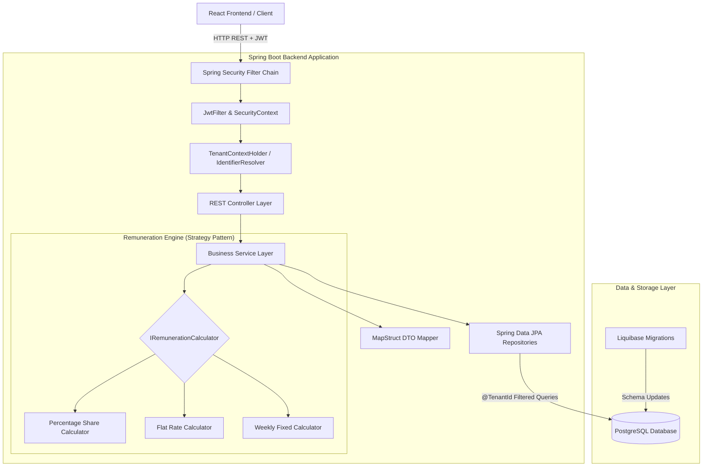
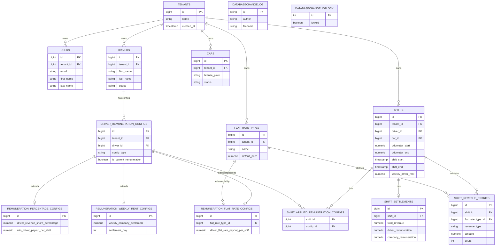

# TaxiOS Backend (REST API)

> **Origin Story:** TaxiOS was born out of a real-world business need: eliminating the administrative pain of manually entering hundreds of paper shift slips into Excel each month. What started as a digitization initiative for a local taxi company has evolved into a production-ready, multi-tenant platform. Today, it actively manages daily operations for a primary tenant with 10+ drivers, fully automating revenue tracking, contract remuneration, and financial reporting. The platform is currently being expanded to include comprehensive fleet management, automated shift scheduling, and detailed cost analytics.

### Live Stage Environment & API Documentation

| Resource              | Link                                                                                              |
| :-------------------- | :------------------------------------------------------------------------------------------------ |
| **Swagger API Docs**  | [https://taxi-stage.mk0.me/api/swagger-ui](https://taxi-stage.mk0.me/api/swagger-ui/index.html#/) |
| **Stage Environment** | [https://taxi-stage.mk0.me](https://taxi-stage.mk0.me)                                            |

> **Demo Credentials**
> - **Admin:** `test-account@example.com` / `TestAccount246#`
> - **Driver:** `lukas.gruber@example.com` / `12341234`

<br/>

**Repositories:**  
- **Backend:** https://github.com/markokosic/taxios-backend  
- **Frontend:** https://github.com/markokosic/taxios-frontend-web *(React 19, TypeScript, Mantine UI & TanStack Query)*

---

## Table of Contents

- [Core Features](#core-features)
- [Tech Stack](#tech-stack)
- [System Architecture & Data Flow](#system-architecture--data-flow)
- [Engineering Decisions & Highlights](#engineering-decisions--highlights)
- [Feature Backlog](#feature-backlog)
- [Quickstart & Development](#quickstart--development)
- [API Documentation & HTTP Testing](#api-documentation--http-testing)

---

## Core Features

### 1. Complex Revenue & Shift Tracking
_Context: The traditional paper shift-slip process is highly prone to manual calculation errors and data loss._
- **Granular Shift Logging:** REST endpoints for daily shift earnings (cash, card, tips), precise odometer readings (`kilometersDriven`), and timeframes.
- **Multi-Stage Approval Workflow:** Shifts traverse a strict lifecycle state machine. Submitted shifts undergo control stages to prevent data entry errors before they are officially accepted and finalized.
- **Data Versioning & Audit Trail:** All shift entries and core entities are strictly versioned to maintain a tamper-proof, immutable history for accounting compliance.

### 2. Dynamic Driver Remuneration Engine
_Context: Taxi drivers operate under vastly different contract models, making manual payroll a nightmare._
- **Automated Payout Splits (Strategy Pattern):** The backend dynamically routes calculations through the `IRemunerationCalculator` interface to instantly resolve driver payouts vs. net company retention.
- **Polymorphic Contracts:** Seamlessly computes limits and minimums for `PERCENTAGE_SHARE`, `WEEKLY_FIXED_RATE`, and `FLAT_RATE` models.
- **Time-bound Contract Versioning:** Contracts use `validFrom` and `validUntil` date bounds, ensuring historical shifts are always recalculated against the exact contract rules active at the time.

### 3. Security & Multi-Tenancy
_Context: Taxi fleets need multiple administrative and operational users without compromising data isolation._
- **Strict Data Isolation (Row-Level):** Transparent multi-tenant query filtering via Hibernate `@TenantId` ensures each taxi company operates in a completely isolated workspace on a shared database.
- **Atomic Tenant Registration:** Simultaneous creation of a new `Tenant` and its initial admin `User` is executed within a single ACID transaction to prevent partial data states.
- **Stateless JWT Authentication:** Secure, role-based HTTP-only session management.

### 4. Fleet Asset Management
_Context: Vehicle operating costs and shift tracking must be clearly linked to identify unprofitable assets._
- **Vehicle Inventory:** Centralized registry of license plates, VINs, horsepower, and operational statuses (`ACTIVE`, `MAINTENANCE`).
- **Shift Linkage:** Vehicles are assigned to shifts by ID to accurately track "revenue per car".

### 5. Financial Analytics & Reporting
_Context: Fleets need to identify month-over-month growth and profitable entities at a glance._
- **Multi-Dimensional Grouping:** Generate financial reports dynamically grouped by `DRIVER`, `CAR`, or `DATE`.
- **Dashboard KPIs:** Real-time, anti-N+1 optimized queries to aggregate total gross revenue, company share, driver payouts, and active vehicle count for current and past periods.

---

## Tech Stack

| Domain | Technology | Version | Role / Description |
| :--- | :--- | :--- | :--- |
| **Backend Runtime** | Java 21 / Spring Boot | `3.5.4` | REST API framework, dependency injection & security |
| **Database** | PostgreSQL | `15+` | Relational database with strict row-level `@TenantId` data isolation |
| **ORM & Persistence** | Spring Data JPA / Hibernate | `3.5.4` | Entity mapping & automated row-level multi-tenancy filtering |
| **Security & Auth** | Spring Security & JJWT | `0.12.6` | Stateless JWT authentication, authorization & filter chain |
| **DB Migrations** | Liquibase | `4.33.0` | Version-controlled database schema evolution |
| **DTO Mapping** | MapStruct | `1.5.5` | Compile-time bean mapping between Entities and DTOs |
| **Boilerplate Reduction** | Lombok | `Latest` | Annotation-based getters, setters, and builders |
| **API Specification** | Springdoc OpenAPI | `2.8.15` | Automated OpenAPI 3.0 spec generation for Frontend codegen |
| **Testing & Coverage** | JUnit 5, Mockito & JaCoCo | `0.8.12` | Unit/Integration testing with automated coverage reporting |
| **Frontend Counterpart** | React 19 / TypeScript | `^19.2.0` | Consumes OpenAPI spec via Orval for client-side type safety |
| **CI / CD** | GitHub Actions | `--` | Automated testing, linting, and VPS deployment |
| **Deployment & Hosting** | Docker, Traefik & VPS | `2.11` | Multi-stage Docker container deployed alongside Nginx frontend |

---

## System Architecture & Data Flow

### Backend Architecture (Modular Monolith)



### Domain Entity Model



---

## Engineering Decisions & Highlights

Here is a simple overview of the core architectural decisions that drive the backend:

### 1. Row-Level Multi-Tenancy (Hibernate `@TenantId`)
- **Implementation:** The system uses a Shared Database, Shared Schema model. Hibernate `@TenantId` automatically appends `WHERE tenant_id = ?` to all JPA queries.
- **Impact:** Provides strict tenant data isolation while maximizing infrastructure efficiency compared to a database-per-tenant model.
- **Trade-off:** All database tables must explicitly include a `tenant_id` discriminator column.

### 2. Strategy Pattern (Remuneration Models)
- **Implementation:** Revenue split logic is encapsulated behind an `IRemunerationCalculator` interface (e.g., `PercentageRemunerationCalculator`, `FlatRateRemunerationCalculator`).
- **Impact:** Keeps complex financial calculation logic completely decoupled, highly testable, and compliant with the Open/Closed Principle. 

### 3. Contract-Driven API (`Springdoc OpenAPI`)
- **Implementation:** The backend acts as the Single Source of Truth. Springdoc inspects Spring controllers and automatically generates an OpenAPI 3.0 specification (`/v3/api-docs`).
- **Impact:** Generates real-time, zero-drift API specifications that power automatic client generation for the frontend.
- **Trade-off:** DTOs require explicit OpenAPI annotations to provide detailed schema descriptions.

### 4. Cent-Accurate Financial Precision
- **Implementation:** All financial values and rates are handled via `java.math.BigDecimal` in Java and stored as `numeric(38,2)` in PostgreSQL.
- **Impact:** Completely eliminates IEEE 754 floating-point rounding errors that can cause financial discrepancies.

### 5. Atomic Tenant Registration
- **Implementation:** Tenant signup executes inside a single atomic transaction, utilizing native SQL for the initial admin user creation.
- **Impact:** Resolves Hibernate session-locking conflicts during nested entity creation, ensuring ACID guarantees without disabling `open-in-view=false`.

### 6. Anti-N+1 Query Optimization
- **Implementation:** The repository layer strictly enforces `@EntityGraph` for joined fetches, supplemented by `@BatchSize` on collections.
- **Impact:** Prevents classic Hibernate Eager-Fetching issues during complex shift aggregations and reporting.

### 7. Deterministic Migrations (Liquibase)
- **Implementation:** Database schema evolution is managed via version-controlled Liquibase scripts.
- **Impact:** Provides deterministic, safe database migrations suitable for production, ensuring critical indexes on `tenant_id` are never missed.
- **Trade-off:** Requires writing explicit migration scripts instead of relying on automatic JPA schema generation.

---

## Feature Backlog

- **Shift Planning & Calendar:** Interactive calendar for scheduling upcoming shifts, assigning vehicles, and providing driver-specific views for their upcoming work schedule.
- **Cost Center Controlling & P&L:** Comprehensive tracking of vehicle expenses (fuel, maintenance, insurance), payroll overhead, and automated Net Income calculation.
- **Tax & Collective Agreement Compliance:** Robust handling of regional tax brackets, tax-free allowances, and strict adherence to mandatory collective wage agreements (*Kollektivverträge*).
- **Advanced RBAC (Role-Based Access Control):** Fine-grained permissions and custom roles (e.g., `ADMIN`, `ACCOUNTANT`, `DISPATCHER`, `DRIVER`) for secure fleet management.
- **Payment Integration:** Automated billing, digital driver payouts, and subscription management via third-party providers (e.g., Stripe, SEPA).
- **Advanced Analytics & Reporting:** Interactive dashboard KPIs, graphical revenue statistics, and formal PDF/CSV exports (e.g., DATEV) for seamless bookkeeping.
- **Shift Handover & Telematics:** Odometer tracking, damage reporting, and automated taximeter data ingestion.

---

## API Documentation & HTTP Testing

### Interactive Swagger UI & OpenAPI 3.0
- **Swagger UI:** `http://localhost:8080/api/swagger-ui.html` (or `/api/swagger-ui/index.html`)
- **OpenAPI JSON Spec:** `http://localhost:8080/api/v3/api-docs`

### HTTP Request Collection
The `requests/` directory contains pre-configured HTTP request files for IntelliJ / VS Code REST Client testing:
- `requests/auth.http` – Tenant registration, login, and JWT token refresh
- `requests/car.http` – Vehicle CRUD operations and fleet status management
- `requests/driver.http` – Driver management and remuneration configurations
- `requests/revenue.http` – Daily revenue logging and bulk entries
- `requests/report.http` – Dashboard metrics and aggregated financial reports

---

## Quickstart & Development

### Prerequisites
- **Java Development Kit (JDK):** Version 21
- **Build Tool:** Maven 3.9+ (or included `./mvnw` wrapper)
- **Database:** PostgreSQL 15+

### 1. Environment Configuration (`.env`)

Create or verify `.env` in the backend root directory:
```env
SPRING_DATASOURCE_URL=jdbc:postgresql://localhost:5432/taxicrm_db
SPRING_DATASOURCE_USERNAME=your_db_user
SPRING_DATASOURCE_PASSWORD=your_db_password
JWT_SECRET=your_jwt_secret_key_here_must_be_at_least_256_bits
```

### 2. Database Setup (Docker)

Launch a local PostgreSQL database container:
```bash
docker run --name taxicrm-db \
  -e POSTGRES_DB=taxicrm_db \
  -e POSTGRES_USER=your_db_user \
  -e POSTGRES_PASSWORD=your_db_password \
  -p 5432:5432 \
  -d postgres:15-alpine
```

### 3. Development Mode

```bash
# Build and package skipping tests
./mvnw clean package -DskipTests

# Start Spring Boot application
./mvnw spring-boot:run
```
Backend API will be accessible at `http://localhost:8080`.

### 4. Testing & Build

```bash
# Run unit and integration tests
./mvnw test
```

> **Deployment Note:** Production deployment is handled automatically via GitHub Actions CI/CD (`deployment.yaml`) on push to `main` or `stage`, which builds the Spring Boot container and orchestrates it alongside PostgreSQL and Nginx in the root project.
