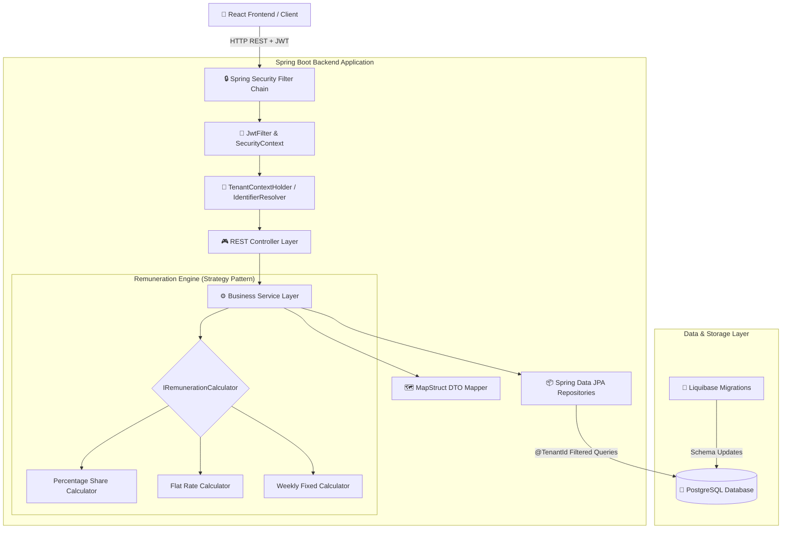
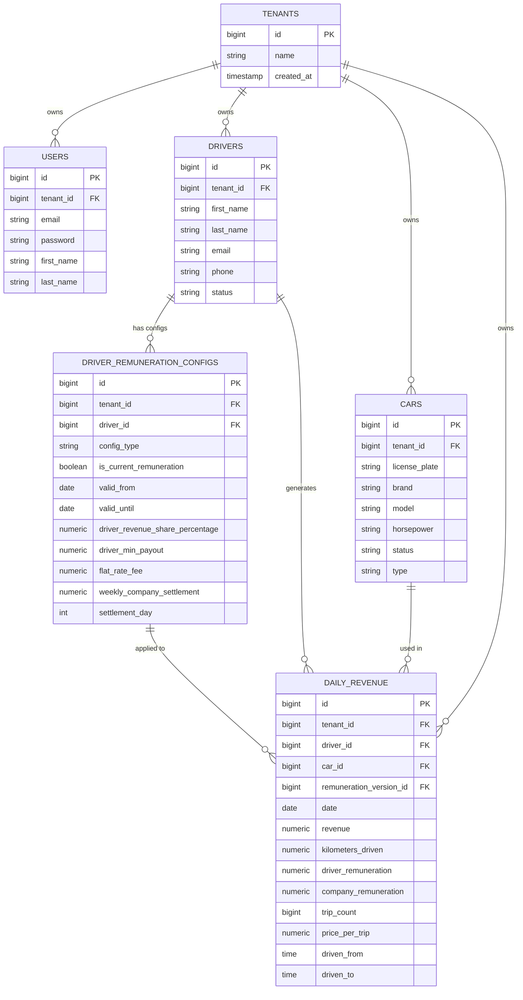

# TaxiOS Backend API

Multi-tenant backend platform for managing taxi fleets, shift revenues, driver remuneration models, and financial reports.

### 🚀 Live Stage Environment & API Documentation

| Resource | Link |
| :--- | :--- |
| 🛠️ **Swagger API Docs** | [Open Interactive Swagger UI](https://taxi-stage.mk0.me/api/swagger-ui/index.html#/) |
| 🌐 **Stage Environment** | [https://taxi-stage.mk0.me](https://taxi-stage.mk0.me) |

> **Demo Credentials**
> - **Email:** `test@tenant.com`
> - **Password:** `TestTenant123`

**Repositories:**  
- **Backend:** https://github.com/markokosic/taxios-backend  
- **Frontend:** https://github.com/markokosic/taxios-frontend-web *(React 19, TypeScript, Mantine UI & TanStack Query)*

---

## Table of Contents

- [Business Problem & Solution](#business-problem--solution)
- [Core Features](#core-features)
- [Tech Stack](#tech-stack)
- [System Architecture & Data Flow](#system-architecture--data-flow)
- [Engineering Highlights](#engineering-highlights)
- [Key Architectural Decisions & Trade-offs](#key-architectural-decisions--trade-offs)
- [Quickstart & Development](#quickstart--development)
- [API Documentation & HTTP Testing](#api-documentation--http-testing)
- [Feature Backlog](#feature-backlog)

---

## Business Problem & Solution

Operating a taxi fleet involves daily bookkeeping, handling multiple payment methods (cash, card, tips), managing different driver contract models, and tracking vehicle costs across multi-tenant environments.

1. **Revenue Tracking & Driver/Company Payout Splits**
   - *Problem:* Drivers operate under varied contract models (percentage split, weekly fixed fee, daily flat rate). Manual calculation of driver payouts and company retention in spreadsheets is time-consuming and error-prone.
   - *Solution:* Daily shift revenue logging (cash, card, trips). The backend automatically calculates cent-accurate driver payouts and net company shares using dynamic, versioned remuneration calculation strategies.

2. **Fleet & Driver Management**
   - *Problem:* Vehicle operating costs and driver expenses are often bundled together, making cost allocation and shift tracking unclear.
   - *Solution:* Clear domain separation of vehicle assets (`Car`) and human resources (`Driver`) for shift and cost assignment.

3. **Financial Reporting & Multi-Tenant Data Isolation**
   - *Problem:* Lack of clear insights into monthly or yearly revenue trends, car/driver performance, and isolated multi-tenant data management.
   - *Solution:* Dynamic reporting over customizable date ranges with multi-dimensional grouping by `DRIVER`, `CAR`, or `DATE`, backed by strict database-level row isolation via `@TenantId`.

---

## Core Features

### Revenue Tracking & Shift Management
- **Shift Revenue Logging:** Single and bulk entry of daily shift earnings (cash, card, tips), mileage (`kilometersDriven`), trip count, and shift timeframes (`drivenFrom` to `drivenTo`).
- **Automated Payout Split (Strategy Pattern):** Instantly calculates driver payout vs. net company share according to active contract rules.

### Driver & Contract Management
- **Driver Profiles:** Manage driver contact details and operational statuses (`ACTIVE`, `INACTIVE`).
- **Remuneration Models:**
  - **Percentage Share (`PERCENTAGE_SHARE`):** Configurable driver percentage (e.g. 60%) with optional minimum guaranteed payout (`minDriverPayout`).
  - **Weekly Fixed Rate (`WEEKLY_FIXED_RATE`):** Fixed weekly company fee + designated settlement day (1–7).
  - **Flat Rate (`FLAT_RATE`):** Fixed daily shift fee.
- **Contract Versioning:** Remuneration agreements include `validFrom` and `validUntil` date ranges, preserving historical financial split accuracy even after contract updates.

### Fleet Asset Management
- **Vehicle Inventory:** License plate, make, model, model year, VIN, horsepower, and status (`ACTIVE`, `MAINTENANCE`, `INACTIVE`).
- **Shift Linkage:** Dynamic assignment of vehicles to driver shifts during daily revenue entry.

### Security & Multi-Tenancy
- **Atomic Tenant Registration:** Simultaneous creation of a new `Tenant` and initial `User` in a single atomic database transaction.
- **Stateless JWT Authentication:** Secure token-based access control with HTTP-only session management.
- **Automated Row-Level Isolation:** Transparent multi-tenant query filtering via Hibernate `@TenantId`.

### Reports & Analytics
- **Dashboard Summary:** Overview of total gross revenue, company share, driver payouts, and active vehicle count for the current month and year.
- **Filterable Reports:** Generate financial reports filtered by date range (`dateFrom` to `dateTo`), specific drivers, or vehicles.
- **Multi-Dimensional Grouping:** Group report data dynamically by `DRIVER`, `CAR`, or `DATE`.

---

## Tech Stack

| Domain | Technology | Version | Role / Description |
| :--- | :--- | :--- | :--- |
| **Backend Runtime** | Java 21 / Spring Boot | `3.5.4` | REST API framework, dependency injection & security |
| **Database** | PostgreSQL | `15+` | Relational database with strict row-level `@TenantId` data isolation |
| **ORM & Persistence** | Spring Data JPA / Hibernate | `3.5.4` | Entity mapping & automated row-level multi-tenancy filtering |
| **Security & Auth** | Spring Security & JJWT | `0.12.6` | Stateless JWT authentication, authorization & filter chain |
| **DB Migrations** | Liquibase | `4.33.0` | Version-controlled database schema evolution |
| **DTO Mapping** | MapStruct | `1.5.5` | Compile-time bean mapping between Entities and DTOs |
| **Boilerplate Reduction** | Lombok | `Latest` | Annotation-based getters, setters, and builders |
| **API Specification** | Springdoc OpenAPI | `2.8.15` | Automated OpenAPI 3.0 spec generation for Frontend codegen |
| **Frontend Counterpart** | React 19 / TypeScript | `^19.2.0` | Consumes OpenAPI spec via Orval for client-side type safety |
| **CI / CD** | GitHub Actions | `--` | Automated testing, linting, and VPS deployment |
| **Deployment & Hosting** | Docker, Traefik & VPS | `2.11` | Multi-stage Docker container deployed alongside Nginx frontend |

---

## System Architecture & Data Flow

### Backend Architecture



### Domain Entity Model



---

## Engineering Highlights

1. **Row-Level Multi-Tenancy Architecture (Hibernate `@TenantId`)**
   Uses a Shared Database, Shared Schema model with a `tenant_id` discriminator column (`docs/adr/0001-database-isolation-strategy.md`). Hibernate `@TenantId` automatically appends `WHERE tenant_id = ?` to all JPA queries, providing strict tenant data isolation without multi-database infrastructure costs.

2. **Atomic Tenant Registration & Session Handling**
   To resolve Hibernate session-locking conflicts during tenant signup (`docs/adr/0002-multi-tenancy-registration-atomicity.md`), the signup process executes inside a single atomic transaction utilizing native SQL insertion for initial admin user creation, ensuring ACID guarantees without disabling `open-in-view=false`.

3. **Contract-Driven API Integration (`Springdoc OpenAPI` -> `Orval`)**
   The backend acts as the Single Source of Truth (`docs/adr/0003-openapi-and-frontend-code-generation.md`). Springdoc automatically inspects Spring controllers and DTOs to generate the OpenAPI 3.0 specification (`v3/api-docs`), which the React frontend consumes to generate typed React Query hooks and Zod validation schemas.

4. **Strategy Pattern for Dynamic Remuneration Calculation**
   Revenue split logic is encapsulated behind the `IRemunerationCalculator` interface:
   - `PercentageRemunerationCalculator`
   - `FlatRateRemunerationCalculator`
   - `WeeklyFixedRateRemunerationCalculator`  
   New contract models can be added cleanly without mutating existing split logic (Open/Closed Principle).

5. **Cent-Accurate Financial Precision (`BigDecimal`)**
   All financial values and rates are handled via `java.math.BigDecimal` and stored in PostgreSQL as `numeric(10,2)` or `numeric(38,2)` to avoid IEEE 754 floating-point rounding errors.

---

## Key Architectural Decisions & Trade-offs

| Decision | Alternative Considered | Rationale & Impact |
| :--- | :--- | :--- |
| **Shared Database + `@TenantId` Row Isolation vs. Database-per-Tenant** | Separate PostgreSQL database or schema per tenant | **Rationale:** Maximizes infrastructure efficiency and simplifies connection pooling, while Hibernate `@TenantId` guarantees strict row-level isolation.<br/>**Trade-off:** All tables must include `tenant_id` discriminator columns. |
| **Strategy Pattern for Remuneration Models vs. Polymorphic Endpoints / If-Else** | Hardcoded switch statements or separate REST controllers per model | **Rationale:** Keeps financial calculation logic decoupled, testable, and compliant with the Open/Closed Principle. Allows versioned contracts (`validFrom`/`validUntil`) to be evaluated dynamically.<br/>**Trade-off:** Requires implementing dedicated strategy classes per model. |
| **Contract-First OpenAPI (`Springdoc`) vs. Manual API Documentation** | Handcrafted Swagger YAML or manual Markdown specs | **Rationale:** Generates real-time, zero-drift OpenAPI 3.0 specs directly from Java code & DTO annotations. Powers automatic client generation (`Orval`) for the React frontend.<br/>**Trade-off:** DTOs require explicit OpenAPI annotations for detailed schema descriptions. |
| **Liquibase Migration Scripts vs. Hibernate `hbm2ddl.auto=update`** | Automatic schema generation by JPA | **Rationale:** Provides deterministic, version-controlled database schema migrations suitable for production multi-tenant environments.<br/>**Trade-off:** Requires writing explicit XML/SQL change-logs for schema updates. |

---

## Quickstart & Development

### Prerequisites
- **Java Development Kit (JDK):** Version 21
- **Build Tool:** Maven 3.9+ (or included `./mvnw` wrapper)
- **Database:** PostgreSQL 15+

### 1. Environment Configuration (`.env`)

Create or verify `.env` in the backend root directory:
```env
SPRING_DATASOURCE_URL=jdbc:postgresql://localhost:5432/taxicrm_db
SPRING_DATASOURCE_USERNAME=your_db_user
SPRING_DATASOURCE_PASSWORD=your_db_password
JWT_SECRET=your_jwt_secret_key_here_must_be_at_least_256_bits
```

### 2. Database Setup (Docker)

Launch a local PostgreSQL database container:
```bash
docker run --name taxicrm-db \
  -e POSTGRES_DB=taxicrm_db \
  -e POSTGRES_USER=your_db_user \
  -e POSTGRES_PASSWORD=your_db_password \
  -p 5432:5432 \
  -d postgres:15-alpine
```

### 3. Development Mode

```bash
# Build and package skipping tests
./mvnw clean package -DskipTests

# Start Spring Boot application
./mvnw spring-boot:run
```
Backend API will be accessible at `http://localhost:8080`.

### 4. Testing & Build

```bash
# Run unit and integration tests
./mvnw test
```

> **Deployment Note:** Production deployment is handled automatically via GitHub Actions CI/CD (`deployment.yaml`) on push to `main` or `stage`, which builds the Spring Boot container and orchestrates it alongside PostgreSQL and Nginx in the root project.

---

## API Documentation & HTTP Testing

### Interactive Swagger UI & OpenAPI 3.0
- **Swagger UI:** `http://localhost:8080/api/swagger-ui.html` (oder `/api/swagger-ui/index.html`)
- **OpenAPI JSON Spec:** `http://localhost:8080/api/v3/api-docs`

### HTTP Request Collection
The `requests/` directory contains pre-configured HTTP request files for IntelliJ / VS Code REST Client testing:
- `requests/auth.http` – Tenant registration, login, and JWT token refresh
- `requests/car.http` – Vehicle CRUD operations and fleet status management
- `requests/driver.http` – Driver management and remuneration configurations
- `requests/revenue.http` – Daily revenue logging and bulk entries
- `requests/report.http` – Dashboard metrics and aggregated financial reports

---

## Feature Backlog

- **Cost Center Controlling (*Kostenstellen-Controlling*):** Vehicle-specific costs (fuel/charging, maintenance, insurance, leasing), driver overhead, and general operational expenses.
- **Net Operating Income (P&L) & ROI Analytics:** Automated Net Income calculation (Revenue minus Cost Center expenses) and vehicle-level ROI analysis.
- **Export & Reporting Engine:** Formal PDF shift statements and CSV/Excel exports for bookkeeping (DATEV).
- **Shift Handover & Telematics:** Odometer/fuel tracking and automated telematics/taximeter data ingestion.
- **Fine-Grained RBAC:** Expanded user roles (`ADMIN`, `ACCOUNTANT`, `DISPATCHER`, `DRIVER`).
